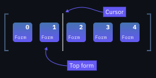

# Novika

[](https://app.gitter.im/#/room/#novika-lang:gitter.im)


> A language that doesn't affect the way you think about programming, is not worth knowing.
> ­— Alan J. Perlis

Novika is a free-form, moldable, interpreted programming language.

---

**Table of contents:**

- [Introduction](#introduction)
- [Examples](#examples)
- [Installing Novika](#installing-novika)
- [Building Novika from source](#building-novika-from-source)
- [Running the examples](#running-the-examples)
- [Playing with the REPL](#playing-with-the-repl)
- [On blocks](#on-blocks)
- [Want to learn more?](#want-to-learn-more)
- [Trade-offs, or why is Novika so slow?](#trade-offs-or-why-is-novika-so-slow)
- [Contributing and internals](#contributing-and-internals)
- [Contributors](#contributors)

---

## Introduction

First and foremost, **Novika is weird**. Why not, though, being inspired by Lisp, Forth, Factor, Self, Red/Rebol, Smalltalk, and so on — the weird kids on the block.

Novika is like simulating a house of LEGO blocks vs. simulating a house of huge concrete blocks, wood, and all that. The latter
is much easier computationally, while the former offers unlimited flexibility. You can build only so much from huge concrete blocks,
wood, chairs, and whatnot. With LEGO, it's another story — an infinite amount of possibilities before you.

Semantically, Novika is like Lisp *A* set in motion by Lisp *B* with the possibility of bidirectional communication and control — but with objects, stacks, and so, so much more!

And the syntax of Novika? Well, there is no syntax. That is to say, almost no syntax. Syntactically, Novika lies somewhere between Lisp and Forth. And Forth — Forth has no syntax.

## Examples

A quine:

```novika
[ 'Some payload here perhaps?' ]
this
each:
echo
```

Hello World:

```novika
'Hello World' echo
```

---

Factorial. Note that parentheses `()` are treated as whitespace in Novika. They also don't have to be matched.

```novika
(5 to: 1) product "120"
```

---

First 100 Fizz buzz rounds:

```novika
1 to: 100 each: [
  [ [ 15 /? ] 'FizzBuzz'
    [  5 /? ] 'Buzz'
    [  3 /? ] 'Fizz'
  ] choose echo
]
```

---

Sieve of Eratosthenes: prints prime numbers in `[2; 120]`.

```novika
2 to: 120 ||-> [ $: n (stack without: [ n /? ]) asStack n ] each: echo
```

---

[Zigzag problem](https://leetcode.com/problems/zigzag-conversion/) from LeetCode, with the examples as tests. Observe the boundary between terseness and readability.

```novika
"""
Not the mathy one but the naive one, because programming is
not math thank goodness!
"""

[ dup 1 = => [ drop ^ ]

  collect: '' dup 1 |to $: grid

  0 $: col

  [ grid |: |> |atRightBound? asc desc sel ] $: desc
  [ grid |: <| |afterFirst? desc asc sel (col 1 + =: col) ] $: asc
  desc @: action

  [ $: char grid |: [ char ~ ] ] @: put

  each: [ put action =: action ]

  grid join
] @: convert


describe 'Zigzag Conversion' [
  in leetcode

  it should 'follow the happy path' [
    'A' 1 convert 'A' assert=
    'A' 3 convert 'A' assert=
    'HELLOWORLD' 1 convert 'HELLOWORLD' assert=
  ]

  it should 'convert given 3 rows' [
    'PAYPALISHIRING' 3 convert 'PAHNAPLSIIGYIR' assert=
  ]

  it should 'convert given 4 rows' [
    'PAYPALISHIRING' 4 convert 'PINALSIGYAHRPI' assert=
  ]
]

runTestsInGroup: leetcode
```

### What about something a bit more elaborate?

- A snake game [example](https://github.com/novika-lang/novika/blob/rev10/examples/snake.new.nk)
- A simple [documentation viewer](https://github.com/novika-lang/novika/blob/rev10/examples/docuview.nk)
- A [prompt](https://github.com/novika-lang/novika/blob/rev10/examples/lch-prompt.nk) that blinks in colors from the LCH color space
- A TDD-d [observable](https://github.com/novika-lang/novika/blob/rev10/examples/observable.nk)
- A [live REPL interface](https://github.com/novika-lang/novika/blob/rev10/examples/mathrepl.nk) to a DSL for infix math expressions

## Installing Novika

The fastest way to get started with Novika is to download and unpack the latest [nightly build](https://github.com/novika-lang/nightly-builds/releases/latest).
Novika [releases](https://github.com/novika-lang/novika/releases/latest) are as unstable as nightlies, if not more so, so don't worry :zany_face:

1. If you don't want to do a system-wide install, simply use `bin/novika` *while in the directory of the nightly/release*.

2. Otherwise, move the `env` folder to your user's home directory, and rename it to `.novika`. Optionally, add `bin/novika` to your PATH.

## Building Novika from source

You will need to have [Crystal](https://crystal-lang.org/install/) installed.

1. Clone this repository:

```
git clone https://github.com/novika-lang/novika.git
```

2. Go there:

```
cd novika
```

### Windows

```
shards build --without-development --release --progress --no-debug
```

### Linux

```
shards build --without-development --release --progress --no-debug -Dnovika_console -Dpreview_mt
```

### What do the `-D`s mean?

* `-Dnovika_console`: use [termbox2.cr](https://github.com/homonoidian/termbox2.cr) as the backend for capability *console*.  Otherwise, *console* won't be available. Since [termbox2](https://github.com/termbox/termbox2) doesn't support Windows, you have to drop the flag when compiling for/under it.

### What's next?

You can optionally add `bin/novika` to PATH, and/or create a symbolic link for `env` called `.novika` in your user's home directory, like so:

```
ln -s /path/to/novika/repo/env /home/<your-user>/.novika
```

I'd recommend you to run the tests with `bin/novika tests`. If something seems wrong, [file an issue](https://github.com/novika-lang/novika/issues/new).

## Running the examples

Try to run one of the [examples](#examples). Some of them contain instructions on how you can run them. In general, you can use:

```
bin/novika path/to/example.nk
```

If it's yelling at you in red that you need *console*, use:

```
bin/novika console path/to/example.nk
```

(unless you're on Windows; Novika on Windows doesn't support console yet)

## Playing with the REPL

To run the REPL, use:

```
bin/novika repl
```

To list all available words, use `la`:

```
>>> la
```

To see documentation for a particular word, use `help` followed by the word that you're interested in:

```
>>> help toOrphan
...
>>> help 123
decimal number 123
>>> help 'Who am I?'
quote 'Who am I?'
```

To get a string description of a thing's type, use `typedesc`:

```
>>> 123 typedesc
... 'decimal' ...
>>> ##foobar typedesc
... 'quoted word' ...
```


## On blocks

Novika is all about blocks! The name is pretty generic, and has little if any connection to "blocks" of mainstream programming languages.

### Blocks are lists with a cursor



Blocks allow you to store different kinds of *forms* one after another. A form could be a number, a string, or even another block!

In this regard, a block is somewhat similar to a Python list or a Ruby array.

Moreover, now taking the *cursor* into account, blocks seem a lot like text input fields but with *arbitrary constituents* rather than just characters.

You can move the cursor back and forth in a block. You can "backspace", insert, and so on, all this not only *empowering computation* but also *backed by computation*.

<br clear="right"/>

```novika
"""
'Cut' the block in half at the cursor using |slice.
"""
[ 1 2 3 4 | 5 6 7 8 ] |slice leaves: [ [ 1 2 3 4 | ] [ 5 6 7 8 | ]  ]

"""
Remember where the cursor is, then slide it forward and double
each 'top' number. Finally, move the cursor back to where it was.
"""
[ 1 2 3 4 | 5 6 7 8 ] |~> [ dup + ] leaves: [ [ 1 2 3 4 | 10 12 14 16 ] ]
```

### Blocks are dictionaries — and objects


Blocks are dictionaries for themselves and for other blocks. The former is useful for *running* blocks, and the latter is useful for *connecting* blocks to each other — to form scopes, object hierarchies, and so on.

Again, you can imagine something like a Python dictionary or — even better — a JavaScript object.

Block dictionaries hold *entries*.

When the key form is seen, looked up in the dictionary, and *opened*, *opener entries* (or *openers* for short) in turn *open* the value form (*open* is Novika-speak for "run", "execute", "evaluate").

On the other hand, *pusher* entries simply push their value form onto the stack.

<br clear="right"/>

```novika
100 $: x
200 $: y
x y + echo  "STDOUT: 300⏎"

[ ${ x y } this ] @: newPoint

100 200 newPoint $: A
300 400 newPoint $: B

A echo "STDOUT: [ ${ x y } this · ${y :: 200} ${x :: 100} ]⏎"
B echo "STDOUT: [ ${ x y } this · ${y :: 400} ${x :: 300} ]⏎"

A.x A.y 2echo "STDOUT: 100⏎200⏎"
B.x B.y 2echo "STDOUT: 300⏎400⏎"
```


### Blocks are stacks

As simple as that: blocks are also stacks, you just have to look at them differently.

Applying operations immediately before (or even after!) the cursor enables brevity often associated with stack-oriented programming languages. You can also move the cursor — this allows to avoid `rot`s and other nasty Forth-isms. Here is how `rot` can be implemented in Novika:

```novika
[ <| swap |> swap ] @: rot
```

Let's execute `1 2 3 rot` step-by-step, as if we were a Novika interpreter.

1. Stack: `[ | ]`, block: `[ | 1 2 3 rot ]`
2. Push `1`, stack: `[ 1 | ]`, block: `[ 1 | 2 3 rot ]`
3. Push `2`, stack: `[ 1 2 | ]`, block: `[ 1 2 | 3 rot ]`
4. Push `3`, stack: `[ 1 2 3 | ]`, block: `[ 1 2 3 | rot ]`
5. Open `rot` with stack: `[ 1 2 3 | ]`: *instantiate* (basically copy) the block `[ <| swap |> swap ]`, and move the cursor to the beginning like so: `[ | <| swap |> swap ]`
6. Open `<|`, stack: `[ 1 2 | 3 ]`, block: `[ <| | swap |> swap ]`
7. Open `swap`, stack: `[ 2 1 | 3 ]`, block: `[ <| swap | |> swap ]`
8. Open `|>`, stack: `[ 2 1 3 | ]`, block: `[ <| swap |> | swap ]`
9. Open `swap`, stack: `[ 2 3 1 | ]`, block: `[ <| swap |> swap | ]`
10. Cursor for block `[ <| swap |> swap | ]` is at end, close it!
11. Cursor for block `[ 1 2 3 rot | ]` is at end, close it!
12. No more blocks to run!

Voilá! It does rotate: `1 2 3 -- 2 3 1`.


### Blocks are vertices


Scoping, inheritance, and composition are all achieved through block relationships in Novika. There are two kinds of relationships: *is a friend of*, and *is **the** parent of*.

- Blocks can have zero or one *parent*.
- Blocks can have zero or more *friends*.

Blocks can change their (and other blocks') relationships (i.e. edges) at runtime, thereby affecting how, which, and whose entries are looked up and opened.

Block relationships can be cyclic: already-queried blocks are simply skipped. For those interested, Novika entry lookup is a weird (mainly for historical reasons and for convenience) combination of DFS and BFS (I guess...) that roughly goes as follows:

- *Is the parent of* relationships of block A are traversed;
- A's friends are traversed;
- The friends of A's parents are traversed.

Together they are known as *the first echelon* in Novika. Then *the second echelon* — parents, friends, and friends of parents of the first echelon — is explored. Novika lookup machinery (and machinery it is!) simply recurses on members of the second echelon; prior to that it queries each member for whatever it is interested in, and turns to recursion only when the query remains unanswered. In general, you can look at the numerous A\* or Dijkstra pathfinding visualizations over at YouTube to see how such traversal might look like. Although the visualizations won't directly apply to Novika, they're still super helpful.

<br clear="right"/>

```novika
[ 100 $: x ] obj $: definesX
[ 200 $: y ] obj $: definesY

"""
Establish a cyclic relationship (remember that parentheses are
treated as whitespace!)
"""
(definesX -- definesY -- definesX) drop

definesX.x leaves: 100
definesX.y leaves: 200

definesY.x leaves: 100
definesY.y leaves: 200
```

### Blocks are code

When you're writing Novika, you're writing blocks. It's like when you're writing Lisp, you're writing lists.

All Novika code you saw or will see is a block — or, rather, is *in* a block. The toplevel block is the one that holds your whole code and doesn't need to be enclosed in `[]`s. You can think of it as of the "file" block, that is, the block which encloses an entire file of Novika source code *implicitly*.

```novika
this echo  "STDOUT: [ this echo · ${__path__ :: '/path/to/folder'} ${__file__ :: '/path/to/folder/file.nk'} ]"
```

### Blocks are continuations

A Novika continuation is a block that consists of two blocks: the stack block, and the code block, like so: `[ [ …code… ] [ …stack… ] ]`. Many words exist that create, add, remove, or modify continuation blocks and continuations. Most of them are so-called *builtins*, which are bits of runnable native code as seen from Novika. Here are some examples:

- [hydrate](https://novika-lang.github.io/docs/hydrate), as in:

  ```novika
  [ 1 2 ] [ + echo ] hydrate  "STDOUT: 3"
  ```

- [open](https://novika-lang.github.io/docs/open) — this is an ancient (and often used) word from which the term *to open* came. What is described as *opening* is in reality a form of *hydration*, but for historical reasons *opening* is used anyway.

  ```novika
  4 [ dup + ] open echo  "STDOUT: 8"
  ```

- [do](https://novika-lang.github.io/docs/do) — opens a block with a new empty (isolated) stack:

  ```novika
  1 2 [ stack echo ] do  "STDOUT: [ ]"
  ```

- And more, see the [words documentation](https://novika-lang.github.io/docs) or env/core.

Stack blocks can be shared between two continuations (as in `open` or opener entries where the block you open shares the stack with the opener block). Code blocks can also be shared, but I have never needed this in practice so there's no word that does something like that in env/core.

In the code block, the cursor is kept immediately after the form that is being opened right now.

- The current (active) continuation can be accessed using the word `cont`, as in:

  ```novika
  1 2 cont echo 3 4  "STDOUT: [ [ 1 2 cont echo | 3 4 ] [ 1 2 ] ]"
  ```

- The stack of the current continuation (dubbed the *active stack* or simply the stack) can be accessed using the word `stack`, as in:

  ```novika
  1 2 <| stack echo |> 3 4  "STDOUT: [ 1 | 2 ]"
  ```

- The code block of the current continuation (dubbed the *active block* or simply the block) can be accessed using the word `this`, as in:

  ```novika
  1 2 this echo 3 4  "STDOUT: [ 1 2 this echo | 3 4 ]"
  ```

- The code block of the previous continuation (and the one that will be *activated* when the current continuation finishes) can be accessed using the word `ahead`. This word is *crucial* for writing human-readable Novika, as in `1 to: 100 only: even? each: echo`:

  ```novika
  [ ahead echo ] @: sneakyPeaky

  1 2 sneakyPeaky 3 4  "STDOUT: [ 1 2 sneakyPeaky | 3 4 ]"
  ```

Finally, the *continuations block* is a single large block that holds individual continuation blocks. The top continuation block is the one that is currently executed. Below is (roughly) what you'd get if you type `conts shallowCopy each: echo` in the REPL. Do not forget `shallowCopy`, or the language will gain consciousness — and this never ends well!!! :)

```novika
[ [ … REPL code … · ${__path__ :: '/path/to/novika/env'} ${__file__ :: '/path/to/novika/env/repl/repl.nk'} ${_pgRoot :: a block} @{startSession :: a block} ] [ ] ]
[ [ … More REPL code … · ${error :: false} ${pgStack :: a block} @{runLine :: ( Q -- )} ] [ ] ]
[ [ ahead thruBlock loop ] [ ] ]
[ [ new $: iterBody iterBody createLoop $: nextLoop $: breakLoop @: startLoop iterBody #break breakLoop opens iterBody #next nextLoop opens startLoop · ${iterBody :: a block} ${nextLoop :: a block} ${breakLoop :: a block} @{startLoop :: a block} ] [ ] ]
[ [ this =: breakTo orphan loopBody hydrate! ] [ ] ]
[ [ orphan iterBody hydrate | repeat ] [ ] ]
[ [ '>>> ' readLine br: [ runLine ] [ 'Bye.' echo break ] ] [ ] ]
[ [ ahead thruBlock ahead thruBlock br ] [ ] ]
[ [ runLine ] [ ] ]
[ [ … More REPL code … · ${line :: 'conts shallowCopy each: echo'} ${self :: ( Q -- )} ${durationMs :: 0} ${pgRootInstance :: a block} ${pgStackCopy :: a block} ] [ ] ]
[ [ [ reportError #true =: error self resume ] @: __died__ [ pgStackCopy pgRootInstance line slurp hydrate! ] measure | =: durationMs · @{__died__ :: a block} ] [ ] ]
[ [ monotonic $: t1 do | monotonic $: t2 t2 t1 - · ${t1 :: 35111923.17418} ] [ ] ]
[ [ pgStackCopy pgRootInstance line slurp hydrate! ] [ ] ]
[ [ conts shallowCopy each: echo ] [ 1 2 3 4 ] ]
```

Don't be scared, it's just a bunch of letters :)

## Want to learn more?

1. Explore files in `tests/` to see how various words can be used. Beware, however, that those are internal behavior tests — and most of the time, they aren't practical/particularly readable.
2. Explore `help` messages of various words. Read word documentation [here](https://novika-lang.github.io/docs/).
3. Explore files in `env/core`, the language's standard library.
4. Explore the [Wiki](https://github.com/novika-lang/novika/wiki).

I know there aren't a lot of materials here nor anywhere that'd teach you the language. On the fundamental stuff, the language is so weird I can't even remember how it all came to be. And in general I have so much to say that I just don't know where to begin. Hopefully, there will be more stuff here someday.

Explore Novika as if it were an alien spaceship that accidentally fell on Earth, full of weird little yellow rotating yukoos. The aliens did not write on every button what it will do when you press it. And even if they did, what kind of language would they be using?!

## Trade-offs, or why is Novika so slow?

Of course, I had to make some trade-offs to achieve such a peculiar arrangement!

### Negative performance

*Wait, what?*

See, good compilers/interpreters live well in the positives. That is to say they remove irrelevant runtime. Bad compilers and “normal” interpreters live near zero, at the very least getting rid of the notion of parsing.

And what about Novika? Novika is deep in the negatives. Novika *parses* at runtime. Yup, you’ve heard it right.

Waging wars with FFI will give you performance, sure (that is, will move you closer to zero from the negative side!) But then, why not simply use C, Rust, Crystal, or any other fancy-schmancy programming language — especially if you're doing something *serious*?

### Readability

*It's up to you.*

Maybe you want your code to look cryptic — so your friends think you’re a hacker or something. Novika will not stand in your way.

But wait, why is that? Why is Novika not *designed* to be readable? Isn't that popular nowadays?

See, in Novika, it is easy to make your code readable — even natural language-like. This ease, however, degrades performance. That is, enforcing style or syntax degrades performance. Even if Novika someday gets a JIT, writing natural-language-like code will still impose a performance penalty, however minuscule it will be. The choice between complete, high-level control over the language and the machinery involved vs. performance is up to you.

### Big projects

*Never.*

I have no clue what big projects are, or what they need. There are enough smart people in this world already, and I'm certainly not one of them.

I would say Novika is an interesting experiment and a great personal project. Perhaps the language will grow into something bigger a few years from now. Most likely, however, it'll die. Maintaining a general-purpose programming language in the 21st century is hard ­— there's just so much it must be able to do! After all, we are not drawing rectangles at the speed of a snail today, are we?

## Contributing and internals

First of all, thank you for even getting this far! Even if you didn't read the whole document, thank you. Seriously :)

### Where do I start?

1. First of all, the documentation for rev10 (i.e., this implementation) is available [here](https://novika-lang.github.io/novika/).
2. Try exploring [capabilities](https://github.com/novika-lang/novika/tree/rev10/src/novika/capabilities) and their [implementations](https://github.com/novika-lang/novika/tree/rev10/src/novika/capabilities/impl). This is where native code words like `dup` and `appendEcho` are defined. This is also a nice *starting point* to find bugs, optimize, add new stuff, etc. It's also one of the places where you can find typos, lack of documentation, and even some TODOs.
3. Try looking through the [interpreter code](https://github.com/novika-lang/novika/tree/rev10/src/novika) in general. I do have a compulsion to write comments, so most of the code is documented. How well documented is not for me to decide, but documented it is.
4. If you're someone who knows something about optimization, your eyes will hurt! Believe me :)

### What happens where?

When you do your `bin/novika hello.nk`, here's *roughly* the order in which various components get invoked:

1. [The command-line interface](https://github.com/novika-lang/novika/blob/rev10/src/cli.cr) frontend is what greets you (or doesn't) and sets everything up.
2. [Resolver](https://github.com/novika-lang/novika/blob/rev10/src/novika/resolver.cr) knows where everything is on the disk.
3. [Capability collection](https://github.com/novika-lang/novika/blob/rev10/src/novika/capability.cr) allows to control the capabilities of this particular invokation of the language/capabilities of the language overall. For example, this component is aware of you droping the `-Dnovika_console` flag.
4. [Capability interfaces and implementations](https://github.com/novika-lang/novika/tree/rev10/src/novika/capabilities) describe and implement those capabilities.
5. [Scissors](https://github.com/novika-lang/novika/blob/rev10/src/novika/scissors.cr) cut the contents of `hello.nk` (or any other blob of source code) into pieces called *unclassified forms*
6. [Classifier](https://github.com/novika-lang/novika/blob/rev10/src/novika/classifier.cr) classifies them, and shoves the resulting [forms](https://github.com/novika-lang/novika/tree/rev10/src/novika/forms) into a *file block*.
7. [Blocks](https://github.com/novika-lang/novika/blob/rev10/src/novika/forms/block.cr) are *the* most important forms in Novika.
8. [Engine](https://github.com/novika-lang/novika/blob/rev10/src/novika/engine.cr) [runs](https://github.com/novika-lang/novika/blob/db440e7f8ba4342a9eaacf77f76b6c59bc49528f/src/novika/engine.cr#L307) file blocks and all blocks "subordinate" to them. **This is the entrypoint for code execution, and one of the cornerstones of Novika**.
9. [Errors](https://github.com/novika-lang/novika/blob/rev10/src/novika/error.cr) happen. Or don't.

Note that most of these components interact with each other, making this list pretty pointless "for science".

### Implementing features as a capability (in Crystal) vs. in Novika

TL; DR: The rule of thumb for me is if something requires awareness of the
user's OS or isn't portable/`ffi`-compatible, it should be implemented as a
capability (meaning in Crystal).

For instance, networking, reading/writing files, building paths -- all of this
requires awareness of the underlying OS, due to different syscalls, permission
jugglery, and other slash-vs-backslash kinds of issues.

Novika is a high-level interface -- you won't believe it, a *language*! Whether
the underlying ("discussed") objects are from the native code "reality" or
constructed with the means of the language, is completely irrelevant to
the end user, nor to Novika the High-Level Interface.

Again, Novika is a slightly different way of thinking, sure, but certainly
not an operating system!

Note that e.g. SDL is cross-platform provided you put the dynamic libraries
for it in the proper place. Moreover, `ffi` is a capability and is cross-platform.
So it's perfectly valid to use `ffi`, the only requirement being that the library
you're `ffi`-ing is cross-platform.

Novika code is supposed to be run in a sandbox of sorts, like JavaScript in the
browser. The gatekeeper of sorts is called the *resolver* (perhaps I should
rename it to gatekeeper though 💩).

Inside the sandbox, there is no information about the OS. However, the resolver
does have access to this information, so you can branch in your `.nk.app` or `.nk.lib`
like so: `[ windows, linux |  myWindowsFile, myLinuxFile ].nk`.

Now, I know the sandbox is "breachy", but I can't do anything about it! The
world is a dangerous place, huh?

### And the usual procedure

1. Fork it (<https://github.com/novika-lang/novika/fork>)
2. Create your feature branch (`git checkout -b my-new-feature`)
3. Commit your changes (`git commit -am 'Add some feature'`)
4. Push to the branch (`git push origin my-new-feature`)
5. Create a new Pull Request

## Contributors

* [homonoidian](https://github.com/homonoidian) - creator and maintainer
