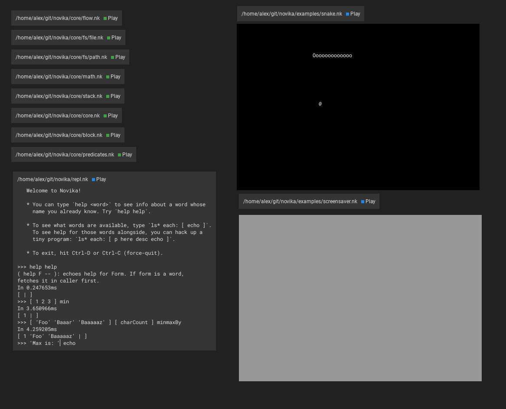

# What the hell is this?

> TLDR: A dirt slow console emulator mostly for Windows portability.

In the future, something a bit like this tiny app would be the Novika
environment GUI (as in Pharo, Cuis, Self, etc.)

This thing is throwaway, I won't refactor nor maintain it. That is, I
will, but only if it doesn't run at all. Anything else is fine.

## Usage

Drag and drop Novika files or folders with Novika files into the window.

Rectangles you see are called activities. Those with the play button are
file activities. There is also a console activity. Hit play to run the
respective file.

You can drag things around. (Input) focus moves with mouse.

### Snake

1. Go into core folder in Novika repo, drag & drop all except fs directory,
   from examples, drag & drop the snake file.
2. Hit play on core.nk.
3. Hit play on all other files.
4. Hit play on snake activity.
5. Move your mouse over the console activity. Play snake. Hit Ctrl-C to
   quit snake (up to the app though, there is no built-in way to do that).

## Build

1. `shards install`
2. `shards build --release --production --no-debug`

Links:

* [SDL2](https://www.libsdl.org/download-2.0.php): devel, run needed.
* [SDL2 TTF](https://github.com/libsdl-org/SDL_ttf/releases): devel, run needed.

### Windows

NEEDS SDL, SDL TTF .lib files to be downloaded manually, copied manually to
wherever Crystal searches for them, AT BUILD-TIME.

NEEDS SDL, SDL TTF .dll files to be downloaded manually and put near the exe,
AT RUNTIME.

### Unix

See step (1), step (2). NEEDS SDL2, SDL TTF at RUNTIME. Possibly devel versions
for both too, unless packaged with the aforementioned or pre-installed?
